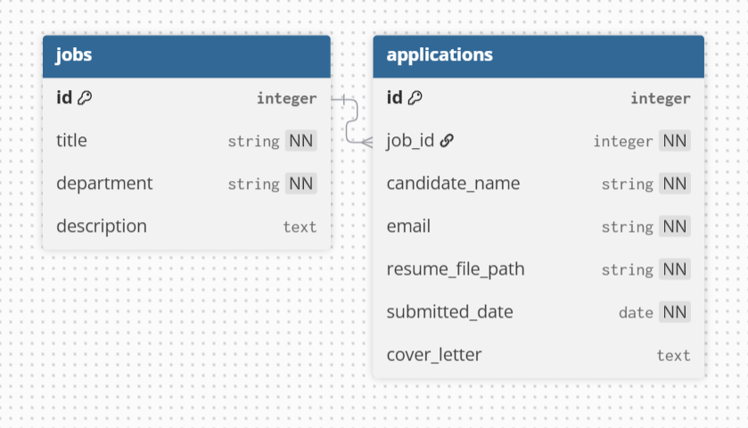

# Candidate Application API [🏡](https://github.com/barronbytes/candidate-application-api)

This is a job application portal that uses FastAPI to handle job search queries and submissions.

## Tech Stack [🔝](#candidate-application-api-)

* **Frontend:** N/A
* **Backend:** Python, FastAPI
* **Database:** SQLite, SQLAlchemy

_Testing performed with unittest_

## Project Structure [🔝](#candidate-application-api-)

``` bash
candidate-application-api/
├── assets/                     # Media files
├── LICENSE                     # Project license (MIT)
├── .gitignore            
├── README.md
├── schema_job.py               # Schemas (Pydantic objects)
├── schema_application.py
├── model_apps_jobs.db          # Models (ORM objects)
├── model_database.py
├── model_table_job.py
├── model_table_application.py
├── service_job.py              # Services (CRUD functions)
├── service_application.py
├── routes.py                   # Routes (API endpoints)
├── main.py                     # App entry point
├── test_app.py                 # Unit test file


# Before running this project locally, ensure you have the following installed:
* IDE (VS Code, PyCharm, etc.)
* Install Python 3.10+ version > visit https://www.python.org/downloads/


# Install dependencies
pip install pydantic
pip install email-validator
pip install fastapi
pip install SQLAlchemy
pip install uvicorn
```

## Data Overview [🔝](#candidate-application-api-)

This project contained a one-to-many relationship between jobs and applications, respectively.



## Usage [🔝](#candidate-application-api-)

The project lacks a frontend. The project can be run in the terminal by typing the command `uvicorn main:app --reload`. Successful runs are followed by a single white page opening with the text _"Welcome to the Candidate Application API!"_. Sample curl commands to use can be found in the unit test file.

## Project Overview [🔝](#candidate-application-api-)


Source: [Implementing FastAPI Services - Abstraction and Separation of Concerns](https://camillovisini.com/coding/abstracting-fastapi-service), by Camillo Visini

This project demonstrated usage of FastAPI to create API endpoints in four phases:
1) **Schemas:** First, BaseModel classes for jobs and applications were created with Pydantic. This involved creating the API shape of request and response objects.
2) **Models:** Next, SQLite and SQLAlchemy were chosen as database tools. Their conventions were followed to enforce ORM object shapes for table records.
3) **Services:** Then, CRUD operations were created to act on tables. Logic had to be introduced to convert Pydantic objects to ORM objects, and vice versa.
4) **Routes:** Finally, API endpoints were formed as destinations for HTTP METHODS to act upon.

## Credits [🔝](#candidate-application-api-)

The official documentation for Pydantic and SQLLite were useful in getting started with this project.

Microsoft Copilot was used to create the unittest file.
